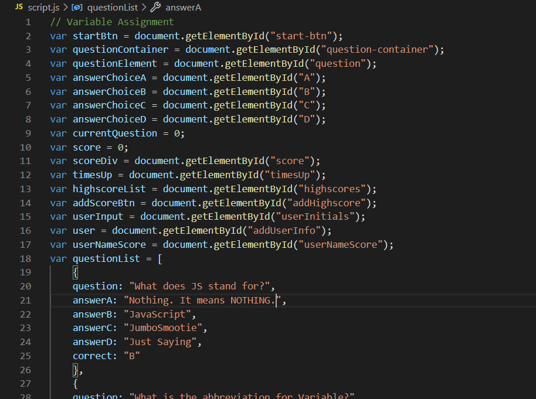
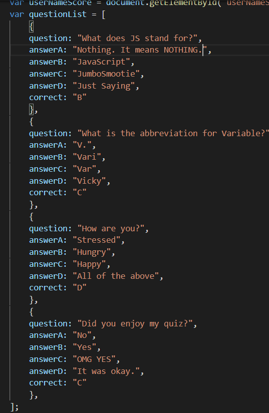
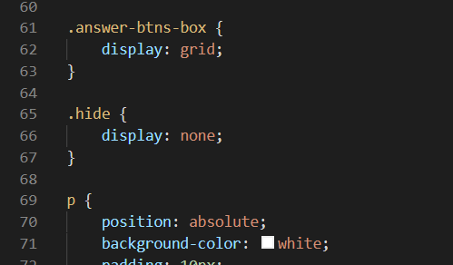
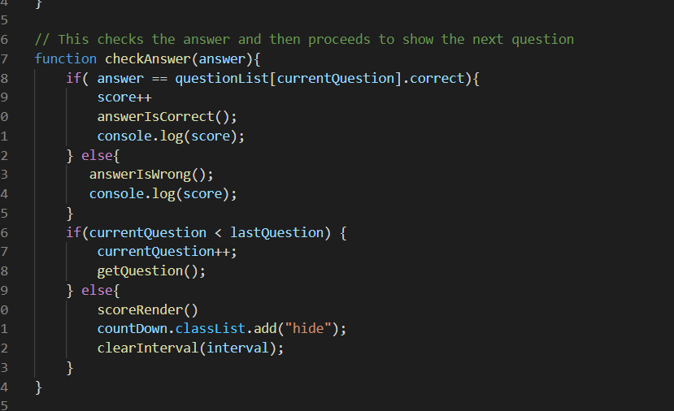
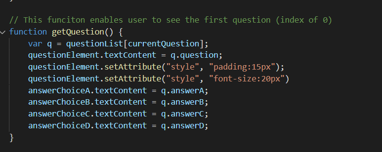
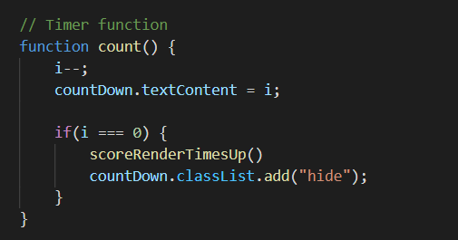

# Coding-Quiz
Quiz game created using JS.

As one would expect, this class just keeps throwing harder and harder assignments towards us. This was by far the hardest one to wrap my head around. While it was difficult, it kept me engaged whenever I would see small steps in progress to making my quiz a reality. Here is how it happened using JavaScript programming.

### Assigning Variables

Often times the first part of a project it seems is to assign variables and figure out what will do what. With the initial creation of the project, I maybe had only 5 or so, but as the project continued I found that I needed more and more as time went on until I had list of variables completed.

I created all of my answers and questions in one object, labled as questionList. It features the question text, all four answer choices, and the correct answer. This is where I will pull all my questions from and push them into my html elements from my variable list.

My variable that had the question container was given a class of "hide". This will help for the next part.

### Starting the Game

Once I had my variables I made a start button that had a functioned activated with a click event. The function basically added the class "hide" which was set to display none in my css. 

When the page is loaded, all the user will see is the start button and highscore button. When the start button is clicked, the function attached to it will add the "hide" class to the start button, and will simultaneously remove the class from the question container, thus showing the questions in the appropriate buttons. 

In order to get the game to register if the button clicked was right or wrong, I created this function called checkAnswer.

When it is used, it will compare what was clicked (parameter called Answer) which was stated in the HTML as well, to the Answer variable that is inside the questionList object. So everytime a button is clicked, it runs the checkAnswer function which compares it to the value of the correct answer in questionList.

In order to tell the computer it was the last question, I created a variable called lastQuestion, which would be the index of the questionList current question but with 1 subtracted from it. So then I used an if statement to say that if the current question was less than the last question value, it would run the function and show the next question. Otherwise, it would show the final score which would mean the game was finished 

### Setting a Timer

In order to create a timer, I made a variable called countDown, which was connected to an empty 
 in the HTML so that I could add the timer to this element and display it. I then created a variable of i which I set equal to the amount of time the player would have to complete the quiz. I used this variable in a function called count, which would be the function that would run when the start button was clicked. Upon being clicked, the value of i would go down by one (i--) and would continue until it was less than 0, in which case it would display a "Time's up!" message. 

If the user completed the quiz in the time given, I set the scoreRender function (function to display score if game was completed by user) to run in the checkAnswer function as an else statement. This would also add the class "hide" to the timer so it would not be shown to the user anymore. 

Overall, this was a super challegning assignment. I was unable to get my highscores button to work in time, but I plan on adding its functionality soon. 

